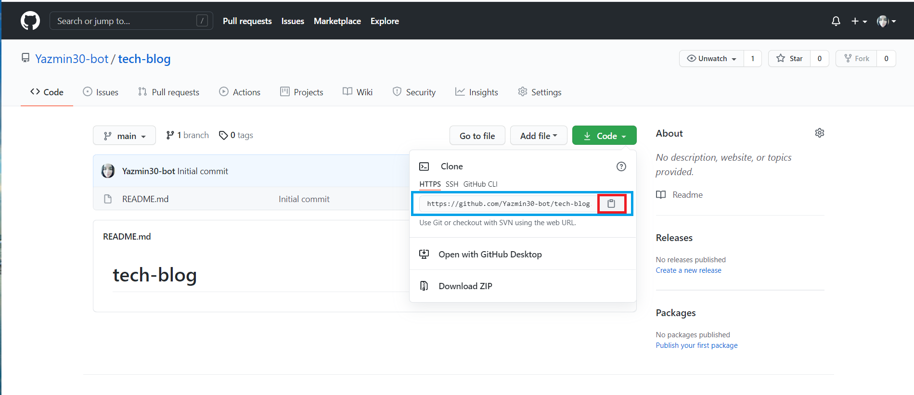
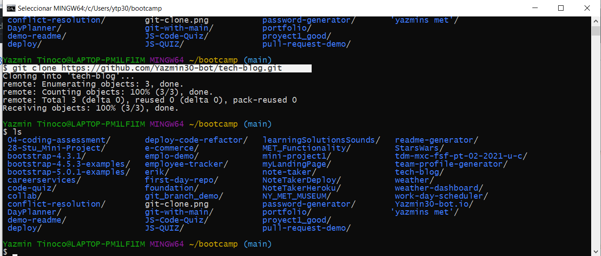
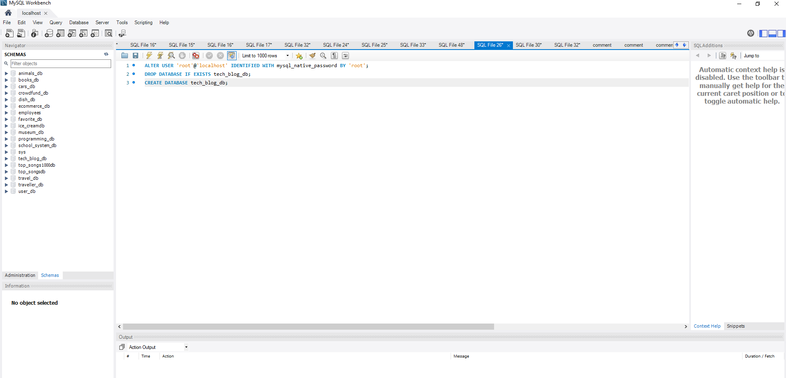

# Tech Blog


## Description
  
  Create an application called Workout Tracker that can be used to publish blog posts and comment on other developers’ posts as well. 
  It follows the MVC paradigm in its architectural structure, using Handlebars.js as the templating language, Sequelize as the ORM, and the express-session npm package for authentication.

  
## Table of Contents
  
  *[Installation](#installation)
  
  *[Usage](#usage)
  
  *[Build-With](#build-with)

  *[Links](#links)

  *[Author](#author)
  
  *[Contributing](#contributing)
  
  *[Questions](#questions)

## Installation
  * Go to the following link [https://github.com/Yazmin30-bot/tech-blog](https://github.com/Yazmin30-bot/tech-blog/) and clone it 
  * Go to Git-bash and page the github's with the following code
    ```
    $ git clone https://github.com/Yazmin30-bot/tech-blog.git
    ``` 
    
  * When you first set up the project before installing any dependencies, make sure that your repo includes a package.json with the required dependencies. You can create one by running 
    ```
    npm init
    ``` 
  * For this project is needed to add the inquirer dependency to package.json file  
    ```
    "dependencies": {
        "bcrypt": "^5.0.0",
        "connect-session-sequelize": "^7.0.4",
        "dotenv": "^8.2.0",
        "express": "^4.17.1",
        "express-handlebars": "^5.2.0",
        "express-session": "^1.17.1",
        "mysql2": "^2.2.5",
        "sequelize": "^6.3.5"
    }
    ``` 
    

  * To install necessary dependencies, run the following command:
    ```
    npm install
    ```
## Usage
  * Create the database using the schema.sql on MySQL Workbench
    

  * To seed the database from the use the  following command line

      ```
    npm run seed
    ```

  * The application will be invoked by using the following command:

    ```bash
    npm start
    ```
  * The following animation demonstrates the application functionality.  
    

  * If you have and error, make sure that the following info are correct with your own data on the .env file
      ```bash
        DB_USER='user'
        DB_PW='password'
        DB_NAME='tech_blog_db'
    ``` 
    or you can use the next code and add it before to create the database on MySQL Workbench

    ```bash
    ALTER USER 'root'@'localhost' IDENTIFIED WITH mysql_native_password BY 'root';
    ```      
    and replace the following data on your .env file

    ```bash
        DB_USER='root'
        DB_PW='root'
        DB_NAME='tech_blog_db'
    ```    
   
## Build with 
  * [Javascript](https://www.javascript.com/) - `Javascript`
  * [NodeJs](https://nodejs.org/en/) - `NodeJs`
  * [MySQL2](https://github.com/sidorares/node-mysql2#readme/) - `MySQL`
  * [Sequelize](https://sequelize.org//) - `Sequelize`
  * [Express](http://expressjs.com/) - `Express`
  * [Dotenv](https://github.com/motdotla/dotenv#readme/) - `Dotenv`

## Links
  * The URL of the deployed application.
  [https://invulnerable-baguette-18839.herokuapp.com/](https://invulnerable-baguette-18839.herokuapp.com/)
  * The URL of the GitHub repository.                                         [https://github.com/Yazmin30-bot/tech-blog/](https://github.com/Yazmin30-bot/tech-blog/)

## Author 
  * **`Yazmin Tinoco`**   - [Yazmin30-bot](https://github.com/Yazmin30-bot/)

## Contributing
  Pull requests are welcome. For major changes, please open an issue first to discuss what you would like to change. 


  
## Questions
  If you have any questions about the repo, open an issue or contact me directly at ytip30@gmail.com.
  You can find more of my work at [Yazmin30-bot](https://github.com/Yazmin30-bot/).